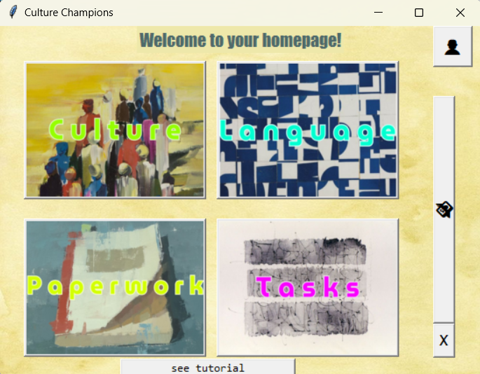
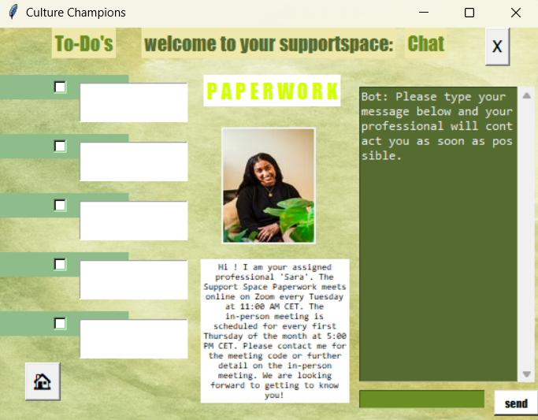

# Culture Champions - Kaja Reutershan's Tech Basic II Exam project

In this repository you can find my Tech Basics II Exam Project Code. The Code represents a MVP that I have buildt, which offers cultural integration and support for people immigrating into another country:

- When the app is being run, the first thing opening is a splash screen that gives the user the information of 'Culture Champions' being loaded.
- After 4 seconds the first screen is being shown. There a language is to be selected out of a dropdown menu and once that is done a short welcoming message is being dispayed in the selected language. With a 'continue' button the user can proceed to the next window.
- The next screen shows a picture and two buttons. One for new and one for known users.
  - For a new user, then they will click on the new user button and are brought to a register screen to put in information. This is data is stored in a user_data.csv file. There you can see the registered users data. Since this is not an app on the market, I feel unworried when tracking the data. It is naturally to me that data safety is one of the most important aspects when using virtual applications and that will be taken care of most certainly.
  - The returning user can put in their log-in information and then proceed further on in the app.
- After submitting the information, the user goes through 4 tutorial pages with an introduction towards the moral principle and the handeling of the applications. There are buttons with arrows to navigate through the pages back and fourth.
- Once the tutorial is done, the home screen offers four image buttons linked to separate Support Spaces (Culture, Language & Paperwork) and one Task page.
    - Each of the Support Spaces will offer a randomly assigned professional with an informational message about meetings etc. in the center, a 'To-Do' area with checkboxes and message boxes to it's left and a chatbot to it's right where a message can be send out to the professional to read.
    - The task page offers three buttons that are connected to a hyperlink and will bring the user to a google documents website where the tasks are supposed to be worked on.
- On the home screen there also are two more buttons on the right side. 
    - One for a profile page that has several customisable message and dropdown boxes for personal information and one for a donation page that explains it's existance shortly and has a 'donate' button placed for donations that is as well connected to a website hyperlink for theoretical donations that will not yet be seriously applied in the mvp test phase.
- The user has the option to switch back and fourth with the pages at all times and there is an exit_button placed on each of the screens that closes the app.

See the homepage below for reference:

Additionally here is a visual representation of one of the Support Spaces (Paperwork):

---
# Acknowledgement

- I want to acknowledge the many artists that arte part of the visual representation of my app. I have included a variety of abstract art pieces i found online - each special and beautiful. And since the entirety of my concept is inclusion and support within different cultures, art as culture itself is essential and unique.
